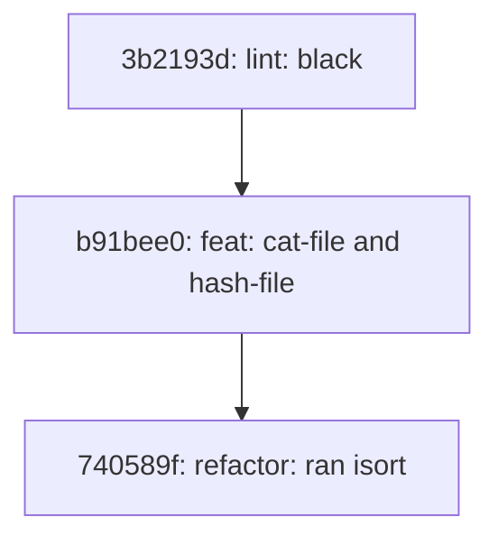

# Write yourself a Git

Implementation of the Git from scratch.
To understand the fundamentals of Git, the CLI tool was developed using Python
and basic shell. The idea comes from [Thibault Polge article](https://wyag.thb.lt/#intro).

The entire application is based on a `guit` command (git with an "extra u").

## How to use it

A very simplified version of Git core commands was implemented.
The list of commands are displayed with command `guit --help`.

### 1. Creating repositories: init

To initialize a new, empty repository:
``` bash
guit init [path]
```
This function initializes the repository by creating the necessary
directories and configuration files:.

``` bash
.git
│───config: configuration file (repositoryformatversion, filemode, bare)
│───description: free-form description of repository (rarely used)
│───HEAD: the reference to the current HEAD (e.g. refs/heads/master)
│
├───branches
├───objects: the object store
└───refs: the reference store
    ├───heads
    └───tags
```

The `config` file is set to:

``` bash
[core]
# the version of the gitdir format.
# 0 means the initial format, 1 the same with extensions.
# guit will only accept 0.
repositoryformatversion = 0
# disable tracking of file modes (permissions) changes in the work tree.
filemode = false
# indicates that this repository has a worktree.
# guit does not support optional worktree key
bare = false
```

### 2. Reading and writing objects

Two commands are implemented: `cat-file`and `hash-object`. There are not
very known... but they are quite simple. The `hash-object` converts
a file to a git object, and `cat-file` prints the raw content of an object,
uncompressed and without the git header.

If you are very confused about Git objects, read a basic understanding of [Git objects](#git-objects "Goto Git-objects").

For example, if you use:

```bash
guit cat-file blob d110cf2ee6b39b1224e6919d26aac168533289d7
```

You will see the contents of the first version of README.


To write a file, you use:

```bash
guit hash-file blob -w README.md
```

The parameter `-w` is used to actually write the object into the git repository.

### 3. Log command

To display the history of a given commit, you can use:

```bash
guit log 3b2193d574be54e31f9c24a8e9478a2eeb307617
```

You will see a Mermaid-compatible directed graph, with nodes representing
commits and edges showing parent-child relationships. You can paste the
code below in [Mermaid live-editor](https://mermaid.live/) to visualize it.



### 4. List files in tree

To display the files in a tree, you can use:

```bash
guit ls-tree f478a2a96fcfd0c71231f126948d6608ca83591b
```

```
100644 blob a8b41082206759a2a6564088573b329861a039ae    classes.py
100644 blob d8c2e471a1f1eb92e5945fbb4edceda554d8d491    cli.py
100644 blob 6c2e1c32a72cec30a8ad56582be59651f15c741d    create.py
100644 blob a1c191d4a251b5ddff07c3af545e5f18ef637874    io.py
100644 blob bbdfbeb1b7cb277dbc756c3f145665e03ce4d6bc    utils.py
```

### 5. Checkout

A very simple checkout method implemented to instantiates a commit in the
worktree. It instantiate a tree in a directory ONLY if the directory is empty
(that's ebcause git has several safeguards to avoid deleting data).

```bash
guit checkout d0abf88de4d39d2dbf9e6a586f921e405bb1f645 test
```

### 6. Show references
References are text files, in the `.git/refs` which holds  SHA-1
identifier of an object, or a reference to another reference, ultimately
to a SHA-1.

To show all references use:

```
guit show-refs
```

```
8c31299f8f1a53c4a02c1d88f6980731f308a005 refs/heads/main
8c31299f8f1a53c4a02c1d88f6980731f308a005 refs/remotes/origin/main
```

### 7. Tag
The tag command let's you create tags as regular refs to commit, tree or
blob. You can create a new tag or list existing tags:

```
guit tag
```

Now to create a tag object (so not only a reference) with  name "first readme" of the README first object
```
guit tag --a --name "first readme"  --object d110cf2ee6b39b1224e6919d26aac168533289d7
```


## To know more

### Git-objects

#### why is this important?

Git is a **“content-addressed filesystem”** - which means the name of a file
is derived mathematically from the contents it has.

This implies in every modification in a file in git means creating a new file in a different path.

The path where git stores a given object is computed by calculating the SHA-1 hash of its contents.

#### the path

The mathematical computation is done by a hash function, which is a kind of unidirectional mathematical function: it is easy to compute the hash of a value, but there’s no way to compute back which value produced a hash.

Git renders the hash as a lowercase hexadecimal string, and splits it in two parts: the first two characters, and the rest. It uses the first part as a directory name, the rest as the file name:

The object with SHA-1 equals to `d110cf2ee6b39b1224e6919d26aac168533289d7` is store in `.git/objects/d1/10cf2ee6b39b1224e6919d26aac168533289d7`.

Git’s method creates 256 possible intermediate directories, hence dividing the average number of files per directory by 256

#### format

An object starts with a header that specifies its type: blob, commit, tag or tree (blobs have no actual format, the most simplest of them).

This header is followed by an ASCII space (0x20), then the size of the object in bytes as an ASCII number, then null (0x00) (the null byte), then the contents of the object.

> header + ' ' + str(len(data)).encode() + b'\x00' + data

Writing an object is reading it in reverse: we compute the hash of the object after
inserting the header, zlib compress everything and write to the location.

#### what is a commit?


A commit object uncompressed without headers has this format:

- A tree object
- Zero, one or more parents;
- An author identity (name and email), and a timestamp;
- A committer identity (name and email), and a timestamp;
- An optional PGP signature
- A message

```bash
tree 29ff16c9c14e2652b22f8b78bb08a5a07930c147
parent 206941306e8a8af65b66eaaaea388a7ae24d49a0
author Thibault Polge <thibault@thb.lt> 1527025023 +0200
committer Thibault Polge <thibault@thb.lt> 1527025044 +0200
gpgsig -----BEGIN PGP SIGNATURE-----

 iQIzBAABCAAdFiEExwXquOM8bWb4Q2zVGxM2FxoLkGQFAlsEjZQACgkQGxM2FxoL
 kGQdcBAAqPP+ln4nGDd2gETXjvOpOxLzIMEw4A9gU6CzWzm+oB8mEIKyaH0UFIPh
 rNUZ1j7/ZGFNeBDtT55LPdPIQw4KKlcf6kC8MPWP3qSu3xHqx12C5zyai2duFZUU
 wqOt9iCFCscFQYqKs3xsHI+ncQb+PGjVZA8+jPw7nrPIkeSXQV2aZb1E68wa2YIL
 3eYgTUKz34cB6tAq9YwHnZpyPx8UJCZGkshpJmgtZ3mCbtQaO17LoihnqPn4UOMr
 V75R/7FjSuPLS8NaZF4wfi52btXMSxO/u7GuoJkzJscP3p4qtwe6Rl9dc1XC8P7k
 NIbGZ5Yg5cEPcfmhgXFOhQZkD0yxcJqBUcoFpnp2vu5XJl2E5I/quIyVxUXi6O6c
 /obspcvace4wy8uO0bdVhc4nJ+Rla4InVSJaUaBeiHTW8kReSFYyMmDCzLjGIu1q
 doU61OM3Zv1ptsLu3gUE6GU27iWYj2RWN3e3HE4Sbd89IFwLXNdSuM0ifDLZk7AQ
 WBhRhipCCgZhkj9g2NEk7jRVslti1NdN5zoQLaJNqSwO1MtxTmJ15Ksk3QP6kfLB
 Q52UWybBzpaP9HEd4XnR+HuQ4k2K0ns2KgNImsNvIyFwbpMUyUWLMPimaV1DWUXo
 5SBjDB/V/W2JBFR+XKHFJeFwYhj7DD/ocsGr4ZMx/lgc8rjIBkI=
 =lgTX
 -----END PGP SIGNATURE-----

Create first draft
```

All this hashed together in a unique SHA-1 identifier.

> Important to note that dictionaries preserve the insertion order and this
> is essential in Git since if we change the order (e.g. putting tree after
> parent), we'd modify the SHA-1 hash of the commit and this would be two
> equivalent but distinct commits.

Since commit is made out of it's parents, they are immutable and
have the hole history

#### what's in a tree?

It’s an array of three-element tuples made of a file mode, a path (relative to the worktree) and a SHA-1. The format is given by:

> [mode] + ' ' + [path] + b'\x00' + [sha-1]

One example is:
``` bash
Mode  | SHA-1 | Path
------------- | ------------- | -------------
100644  | 894a44cc066a027465cd26d634948d56d13af9af | .gitignore
100644  | 94a9ed024d3859793618152ea559a168bbcbb5e2 | LICENSE
100644 | 894a44cc066a027465cd26d634948d56d13af9af | .gitignore
100644 | 94a9ed024d3859793618152ea559a168bbcbb5e2 | LICENSE
100644 | bab489c4f4600a38ce6dbfd652b90383a4aa3e45 | README.md
100644 | 6d208e47659a2a10f5f8640e0155d9276a2130a9 | src
040000 | e7445b03aea61ec801b20d6ab62f076208b7d097 | tests
040000 | d5ec863f17f3a2e92aa8f6b66ac18f7b09fd1b38 | main.c
```
## Contribution

Contributions are welcome! Feel free to fork the repository and submit a pull request.
